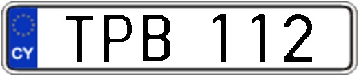

## Cyprus License Plate Generator
**Download and Run. It generates images with YOLO format labels**

**Run**
```buildoutcfg
git clone https://github.com/hci-mkim/Cyprus-License-Plate-Generate.git
python generate.py # to generate passanger car license plate images
```

`assets` folder:

```buildoutcfg
assets
├── chars
    ├── a.jpg
    ├── b.jpg
    ├── c.jpg
    └── ...

├── nums
    ├── 0.jpg
    ├── 1.jpg
    ├── 2.jpg
    └── ...

└── plates
    ├── type_a
        ├── plate_1jpg
        ├── plate_2.jpg
        ├── plate_3.jpg
        └── ... 
    └── type_b
        ├── plate_1jpg
        ├── plate_2.jpg
        ├── plate_3.jpg
        └── ...
    └── type_c
        ├── plate_1jpg
        ├── plate_2.jpg
        ├── plate_3.jpg
        └── ...
    └── type_d
        ├── plate_1jpg
        ├── plate_2.jpg
        ├── plate_3.jpg
        └── ...
└── names.txt
```
This code generates two types of license plate images:white background lp is the one released after 2014, yellow one is before 2014.

Type A:
<div align="center">



</div>

Type B
<div align="center">


</div>


`names.txt` consists from numbers and letter combinations:

```angular2html
0 1 2 3 4 5 6 7 8 9 a b c d e f g h i j k l m n o p q r s t u v w x y z
```

After running the `generate.py` file, `result` folder will appear:
```buildoutcfg
result
├── images
    ├── image_a_0.jpg
    ├── image_a_1.jpg
    ├── image_a_2.jpg
    └── ...
    ├── image_b_0.jpg
    ├── image_b_1.jpg
    ├── image_b_2.jpg

└── labels
    ├── image_a_0.txt
    ├── image_a_1.txt
    ├── image_a_2.txt
    └── ...
    ├── image_b_0.txt
    ├── image_b_1.txt
    ├── image_b_2.txt
```

* Labels are prepared according to YOLO labelling format

To check the class distribution:

```python
python distrib.py
```

Reference

1. [https://github.com/qjadud1994/Korean-license-plate-Generator](https://github.com/qjadud1994/Korean-license-plate-Generator)
2. [https://github.com/yakhyo/Korean-License-Plate-Generator](https://github.com/yakhyo/Korean-License-Plate-Generator)
